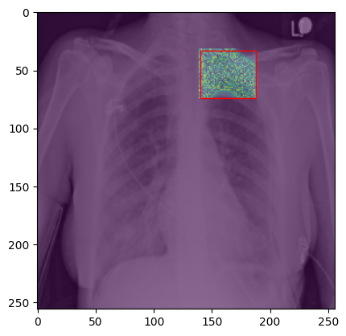

# Pneumothorax_Segmentation

AI model for Pneumothorax detection and segementation using CT scans for chest as an input.

### Data

the data is part of SIIM data of kaggle competetion which is 10675 of chest CT scans (90% training, 10% validation).

### Model

the model is built by fine tuninig maskrcnn resnet50 model of torchvision.

### Training

the training done over 3 epochs using SGD as an optmizer.

### Results

the model achieved the following: \
loss: 0.2736 (0.3378) \
loss_classifier: 0.0231 (0.0386) \
loss_box_reg: 0.0172 (0.0191) \
loss_mask: 0.1955 (0.2612) \
loss_objectness: 0.0060 (0.0134) \
loss_rpn_box_reg: 0.0031 (0.0055)
